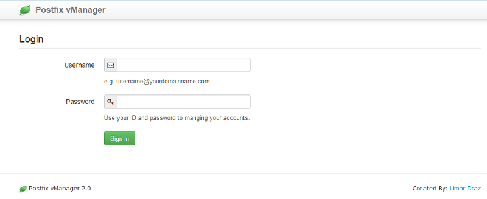
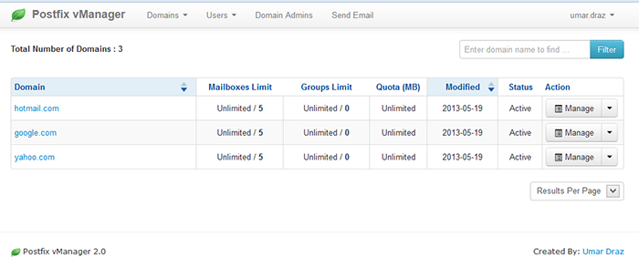
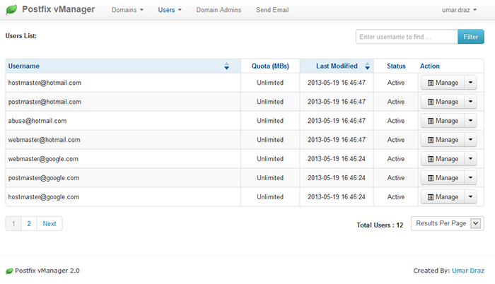
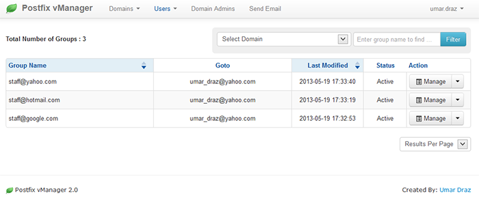

Postfix-vManager
================

Postfix vManager is a Web Based Management tool created for PostMMfix Mail Server Administration with PHP and MySQL

What is it?
============

The Postfix vManager provides an web based virtual mailbox administration system to allow Unix/Linux administrators to easily manage domains, parking domains, alias domain, mailboxes and forwardres. Postfix vManager is free software; you can redistribute it and/or modify it under the terms of the GNU General Public License version 3.

Postfix vManager was written in PHP, It requires PHP 4 and above, Postfix, Dovecot and MySQL 

1. Features
===========

Standard and enhanced features from Postfix vManager includes:

* Super admin user level with full access.
* Domain Admin user level with access only to assigned domains and their mailboxes and aliases.
* Domain admins can create and modify SubDomain admins and mailboxes.
* JQuery Datatable throughout for quick in browser searching and pagination.
* Create, modify and delete domains including the mailboxes and aliases, a non-super admin can create per-domain; Activate / deactivate mailboxes and aliases at the click of a button.
* Facility for users (mailbox owners) to change their password.
* Parking Domain support.
* Alias domain with virtual alias mailboes support.
* Autoresponder (Vacation) support enabled.

2. Screenshots
==============

Here is some screenshots of Postfix vManager.

1. Login Page
-------------

2. Domains List
----------------

3. Users List
-------------

4. Groups List
---------------

2. How to Install
=================

**FreeBSD:** https://github.com/umardraz/Postfix-vManager/blob/master/Postfix-vManager-FreeBSD.rst

**Ubuntu:**  https://github.com/umardraz/Postfix-vManager/blob/master/Postfix-vManager-Ubuntu.rst

**CentOS:**  https://github.com/umardraz/Postfix-vManager/blob/master/Postfix-vManager-CentOS.rst

**For any bug Report or suggesions:** Please email me umar_draz@yahoo.com
